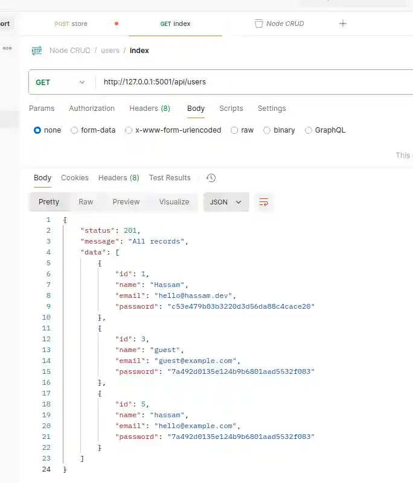

### Preview


### Docker postgres image run
```shell
docker run --name postgres-db -e POSTGRES_PASSWORD=P@$$w0rd -p 5432:5432 -d postgres

# details
docker ps

# inspect
docker inspect CONTAINER_ID

# connect
docker exec -it postgres-db psql -U postgres
```


### kill port
```shell
sudo lsof -i :5001
#COMMAND   PID   USER   FD   TYPE DEVICE SIZE/OFF NODE NAME
# node    21307 hassam   25u  IPv6 230828      0t0  TCP *:5001 (LISTEN)
sudo kill -9 21307

sudo lsof -i :5001
# empty
```


### requirements
```text
`node -v` --> v18.19.01
`npm -v`  --> 9.2.0
`pgsql` --> dpage/pgadmin4:8.14 (docker image)
```


### clean npm cache
```shell
sudo pnpm cache clean -f
```

### start nodemon server
```shell
pnpm run dev:server
```